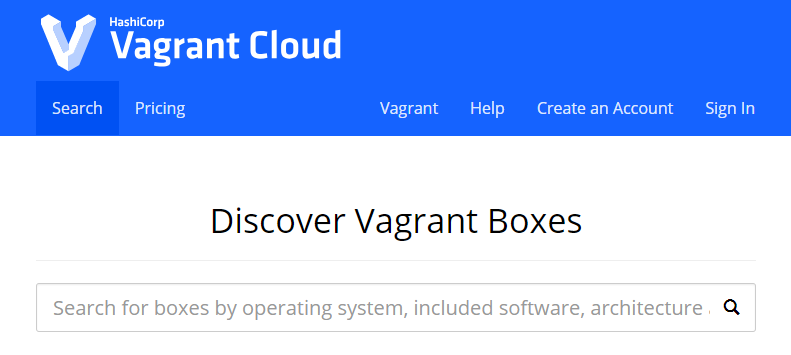

# vagrant

## vagrantとは
仮想マシンの簡単な構築や、どこでも同じ環境を再現できるように仮想マシンを管理するためのコマンドラインツール

### メリット
簡単に仮想マシンを構築できる

さらに構成管理ツール(Chef, Ansible)を使って以下のメリットを受けられる

- 構築手順がコード管理可能になる。
- どんな処理を行っているか明確になる。
- 簡単に共有できるようになる。
- 何度でも同じ結果を得ることができる。(冪等性) ★大事だと思う

Vagrantfileに構成管理ツールを実行するように指定できるので、どこでも同じ仮想マシンを再現できる

## 用語

### Boxファイル
仮想マシン起動時のテンプレートとなるイメージファイル(isoファイルとは異なる)

自前でBoxファイルを作ることもできる(packerなど)

### Vagrantfile
仮想マシンの構成を記述するファイル

主に以下の項目を指定する

- 起動する仮想マシン指定
- ネットワーク設定
- 共有フォルダ設定
- マシンスペック設定(CPUやメモリの割り当てなど)
- プロビジョニング(シェルスクリプトや構成管理ツールの実行指定)


### プロバイダ
仮想化ソフト(仮想環境)のこと

デフォルトではVirtualBoxをサポートしている

プラグインをインストールすれば他の仮想環境(AWSとか)へも適応可能


### プロビジョニング
ミドルウェアのインストールや設定を行うツール
ここではシェルスクリプトや、構成管理ツール(Chef、Puppet、Ansibleなど)のことを指す
Vagrantfile内で指定する


### プラグイン
vagrant plugin installであとから機能を追加できる


## 簡単な手順
- box追加(vagrant box add [name] [url or path])
- vagrantの初期化(vagrant init)
- Vagrantfileの編集
- 仮想マシン起動(vagrant up)
- sshログイン(vagrant ssh)


## box追加
[https://app.vagrantup.com/boxes/search](https://app.vagrantup.com/boxes/search)でインストールするBoxを検索




```bash
$ vagrant box add [name] [url or path]
```

## box一覧を確認

```bash
$ vagrant box list

centos64
centos66
:
```


## 自前でboxを用意する方法
packerを使用する

packer hashicopeが提供しているツール

### 手順
まだやりかたわかってない

